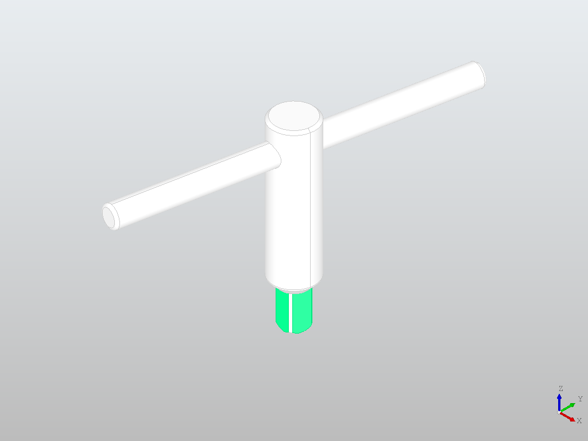
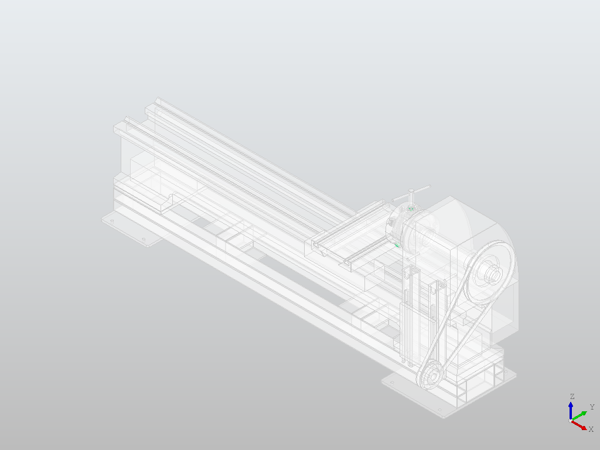
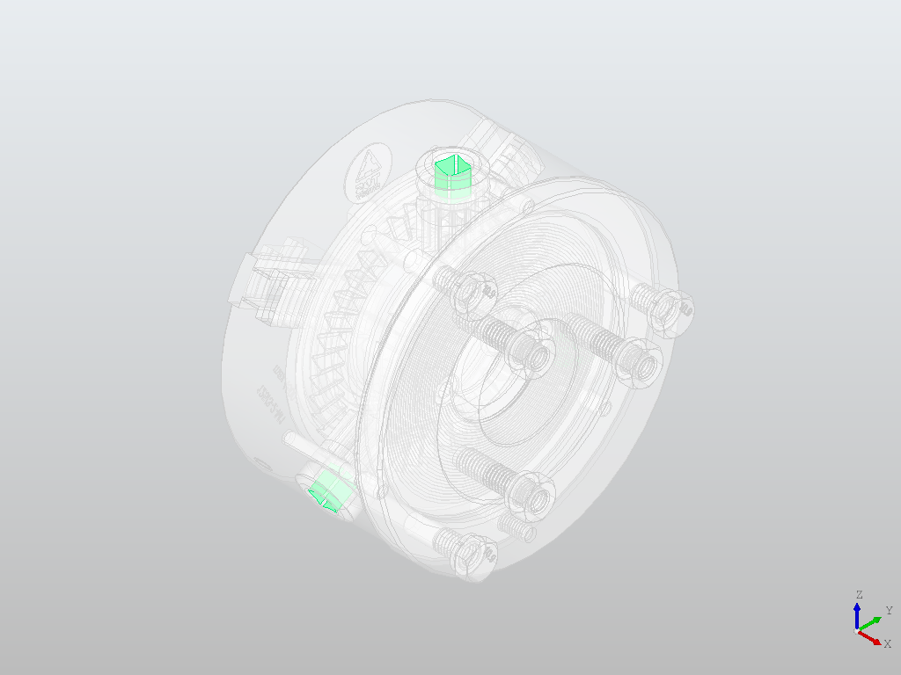
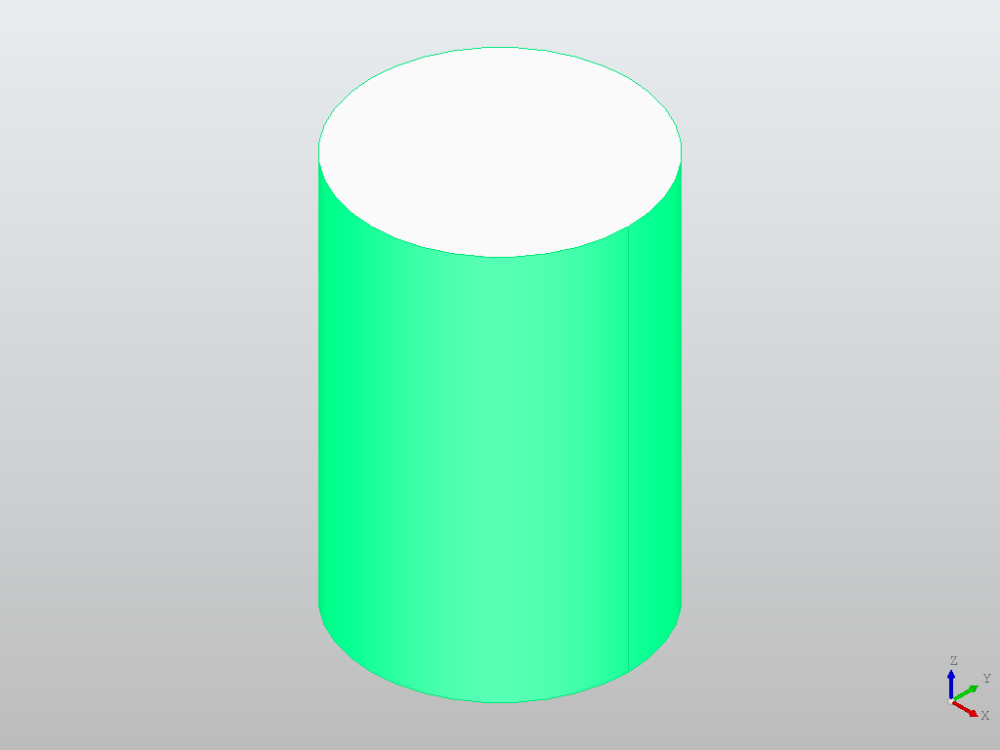
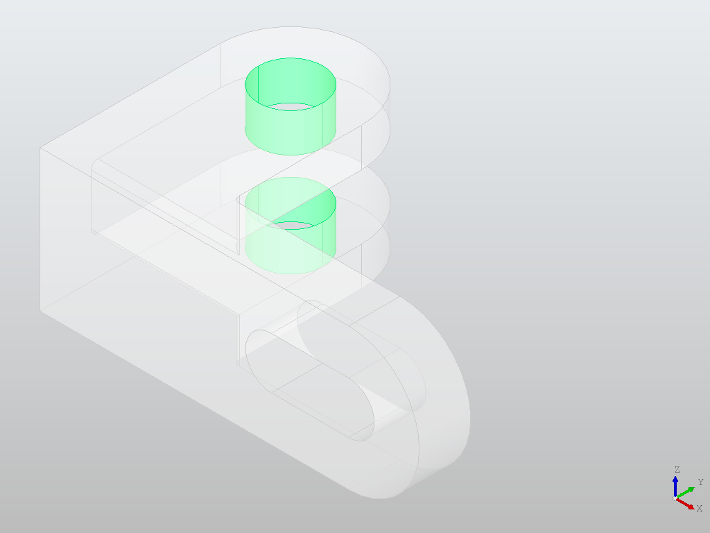
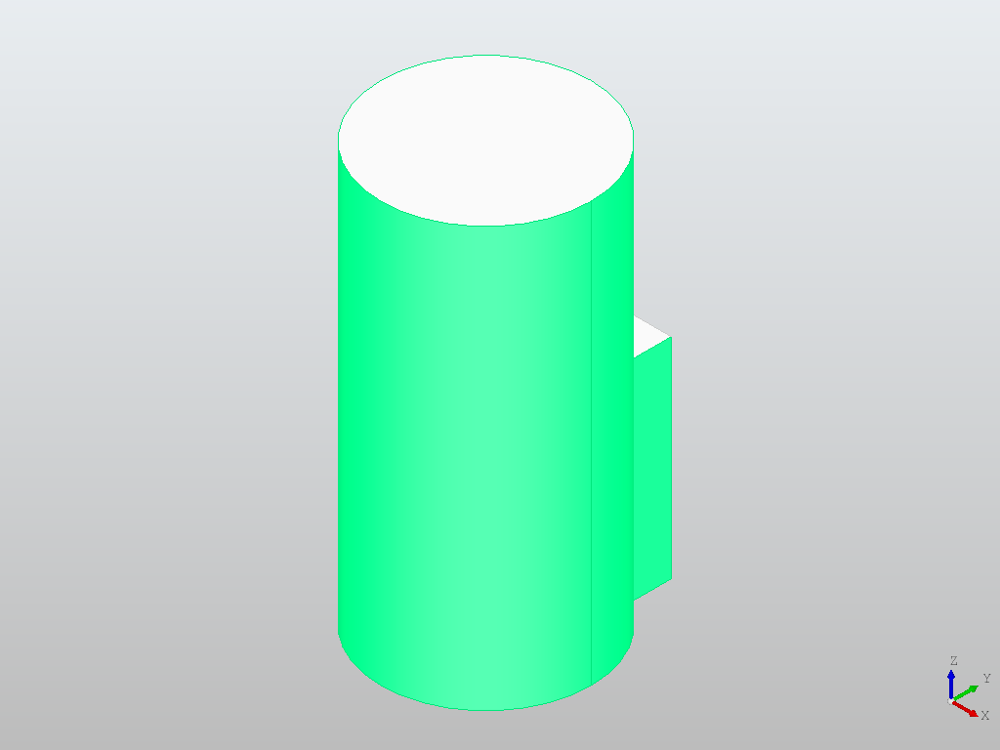
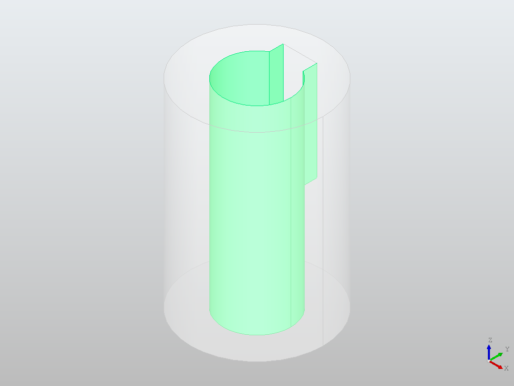

# Assembly Mate Finder

Given a set of faces selected on a part, finds every place in a STEP assembly where those faces fit or mate, and highlights all of them(it tries).

## What it does

- Takes a single-part STEP file and a list of face IDs as the selection (how do you get the face IDs? read on! I tried to implement a 3D viewer where you can click on faces to select them, but that was taking too much time :p)
- Searches a STEP assembly for every face group that geometrically mates with the selection
- Finds all matching instances, not just the first
- Classifies each match as an exact fit or a clearance fit (clearance fit needs some more testing)
- Renders the results as highlighted PNGs

## Approach

The matcher compares geometric relationships between different faces, rather than raw coordinates. Moving or rotating a part changes its XYZ positions but not the angles between its own faces or the distances across them. The tool builds a fingerprint of pairwise relationships (dot products and distances) over the selected faces, then searches for candidate groups in the assembly whose sorted fingerprint matches within tolerance.

For each face, `get_faces` records:
- Surface type (plane, cylinder, cone)
- Area and centroid from `BRepGProp`
- Outward material normal, derived from `face.Orientation()` — this distinguishes a shaft from a bore of the same radius
- Radius, axis direction, and angular/axial extents for curved faces

A candidate group passes if all the below conditions are met:
1. Same type composition as the selection
2. Male/female counts balance — every shaft in the selection requires a bore in the candidate
3. Radii are compatible within the fit band, with the correct sign (a bore smaller than the shaft is rejected as interference)
4. Sorted pairwise fingerprint matches within tolerance

Fit is classified by the largest gap across all mated pairs. Gaps under 0.5 mm report as exact & larger gaps report as clearance.

## Results

### Chuck key in lathe chuck

Selection: 4 planar faces on the chuck key tip (face IDs 1, 3, 14, 16).
Result: 3 matches, one per pinion socket, all reporting exact fit (0.4 mm clearance across flats).





To debug, separated the chuck from the rest of the assembly and ran it across that with the same key and face IDs:





### Rod in bracket

Selection: cylindrical face of a Ø10 rod (face ID 0).
Result: 4 matches — two half-cylinder faces per hole, for two holes, exact fit.




### Keyed shaft in hub

Selection: two side flats and the shaft cylinder (face IDs 0, 2, 5).
Result: 1 match — bore plus both slot walls. Exact fit (0.2 mm bore clearance, 0.1 mm side clearance).
This case exercises mixed-type matching: the fingerprint contains plane–plane, plane–cylinder, and cylinder-only pairs.




Keyed shaft in clearance hub: bore Ø11.0 vs shaft Ø10.0, 
1.0 mm diametral clearance. Reports as clearance fit.


## Matching criterion

For each pair of selected faces, `face_relation` computes:

- **Dot product** of directions — signed for planes (so facing-toward vs facing-away is preserved), unsigned for cylinders (stored axis direction is arbitrary)
- **Distance** — true gap along the normal for parallel planes; centroid distance for perpendicular planes; perpendicular axis-to-axis distance for cylinders

These are compared against the equivalent measurements on each candidate group. Sorting both lists before comparison avoids enumerating permutations while preserving the structural constraint.

## Limitations

**Fit is classified using gaps, and tolerances need to be kept high.** A tight sliding fit will report as exact. The correct approach would be to figure out the remaining degrees of freedom/existing constraints. If the geometry is constrained in 3 dims, it should be an exact fit, if it's 2 dims then clearance. This wasn't implemented, will be planned under future work.

**Every selected face must find a partner.** The chuck key's corner arcs (r=5 mm) and the socket's corner reliefs (r=0.75 mm) are different features by design. They had to be excluded from the selection manually. A better approach would allow for all possible faces to be selected, and still return a valid match.

**Split faces are not merged.** Exporters sometimes split one cylindrical surface into two half-cylinder faces. Each half matches independently, producing two results per hole rather than one.

**Perpendicular plane distance is weak.** Centroid distance depends on face size, so `distance_tolerance` is loose at 2.0 mm. 

**Topological neighbourhoods assume contiguity.** Mating faces more than 2 hops apart in the face adjacency graph are not found. Number of hops can be increased with a tradeoff in execution time.

**Assembly structure is lost.** `STEPControl_Reader` discards part names and hierarchy. Matches are reported by solid index, which shifts between exports.

## What I'd do next

**Constraint rank for fit classification.** I.e. figure out constrained dims and evaluate fit based on the DOF remaining (requires research though). 

**Merge split faces** before matching so a half-cylinder and a full-cylinder can correspond (relatively easier).

**Face selection from a 3D viewer.** Printing out face IDs based on their areas, or rendering images of all faces in a cylinder, one image per face where that face is coloured is an extremely inefficient way to figure out face IDs. This is largely a quality of life improvement. 

## Running

```bash
pip install -r requirements.txt
python mating.py
```

To switch cases, edit the `test = samples[...]` line in `__main__` to one of: `rod`, `keyshaft`, `lathe`, `onlychuck`.

Identify face IDs using `inspection.py`:

```python
from inspection import select_faces, print_faces
select_faces("stepfiles/only_key.step", kind="plane", area=(80, 90))
```

## Test assemblies

I created `rod.step`, `key_shaft.step`, and `hub.step` (clearance as well) myself on FreeCAD, those are uploaded.

`only_key.step` and `onlychuck.step` were extracted from the lathe assembly.

## Requirements

pythonocc-core==7.7.2
numpy

Install via conda (recommended):
```bash
conda install -c conda-forge pythonocc-core numpy
```

Tested on Python 3.10.